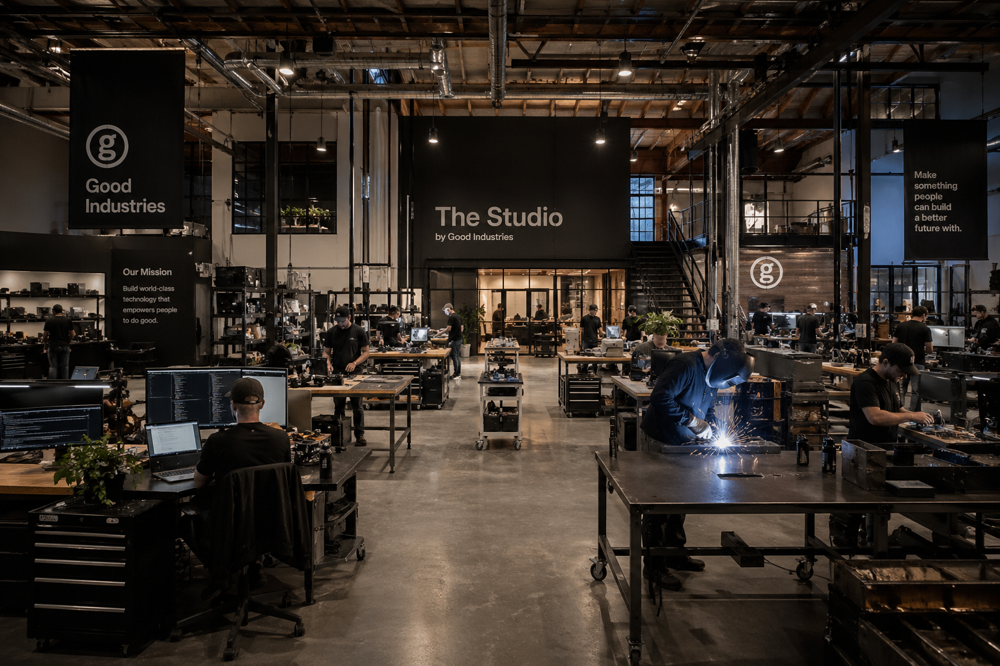
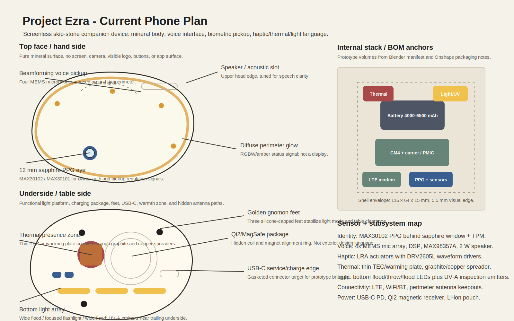
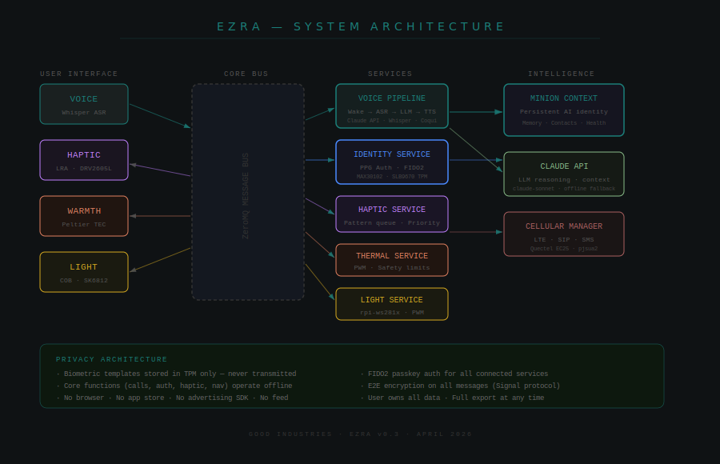

# Project Ezra

**A screenless, voice-first companion phone in active industrial-design development.**


Ezra is a pocketable AI-native communication and identity device that removes the screen entirely. It does not run apps, show feeds, or create an attention surface. It replaces the smartphone's core jobs - calls, messages, navigation, reminders, authentication, ambient awareness, and emergency utility - with voice, biometric presence, haptics, warmth, and light.

The current design direction is a warm translucent KRION/Corian mineral skip-stone form: calm from the outside, technically dense inside, and built around a clear sensor and packaging plan.

## Brought To You By The Studio



Project Ezra comes from The Studio by Good Industries: the hardware, AI, and product workshop inside The Good Project. The Studio is where the concept, industrial design, Blender exploration, Onshape packaging, prototype BOM, and investor demo plan are being pulled into one buildable product direction.

## Current Design Progress

| Area | Current state | Source |
|---|---|---|
| Origin | Brought to you by The Studio, a Good Industries project inside The Good Project | [`studio.png`](studio.png) |
| Hero render | Warm crystalline mineral body with amber internal and perimeter glow | [`Project Ezra.png`](Project%20Ezra.png) |
| Phone plan | Top face, underside, internal stack, sensor map, and BOM callouts | [`project-ezra-phone-plan.svg`](project-ezra-phone-plan.svg) |
| Blender form model | Parametric skip-stone body, material system, glow target, optional feature/package guides | [`ezra_golden_phone/`](ezra_golden_phone/) |
| Blender exports | GLB checked in; OBJ/STL/MTL generated locally for CAD handoff | [`ezra_golden_phone/exports/`](ezra_golden_phone/exports/) |
| Design scenes | Morning guidance, pre-meeting calm, evening wind-down, walk prompt, emotional recovery, and bottom light platform renders | [`ezra_golden_phone/renders/`](ezra_golden_phone/renders/) |
| Onshape package | Product assembly, exploded technical assembly, part studios, and scene assemblies recorded for engineering packaging | [`ezra_golden_phone/ENGINEERING_MANIFEST.md`](ezra_golden_phone/ENGINEERING_MANIFEST.md) |
| Prototype BOM | Procurement and CAD packaging BOM with priorities, estimated pricing, and Onshape reference notes | [`ezra_golden_phone/PROTOTYPE_BUILD_PLAN.md`](ezra_golden_phone/PROTOTYPE_BUILD_PLAN.md) |
| Shape iterations | Twelve silhouette studies used to converge on the skip-stone direction | [`ezra_golden_phone/shape_iterations/`](ezra_golden_phone/shape_iterations/) |
| Earlier nautilus shell | Prior Blender/MCP shell direction and exports retained as design lineage | [`ezra_nautilus/`](ezra_nautilus/) |
| Architecture diagram | System-level hardware/software relationship map | [`system-architecture.svg`](system-architecture.svg) |
| Full spec | Product, hardware, software, identity, privacy, and mechanical packaging spec | [`SPEC.md`](SPEC.md) |
| Hardware spec | Component tables, power budget, PCB architecture, mechanical interface points | [`hardware.md`](hardware.md) |

## Main Phone Plan



### Exterior Envelope

| Parameter | Current target |
|---|---:|
| Length | 116 mm |
| Width | 64 mm palm datum, 60 mm visual head taper |
| Thickness | 15 mm crowned center / 5.5 mm visual edge |
| Weight | 165 g prototype target |
| Material | Warm white KRION/Corian mineral composite |
| Form logic | Flattened nautilus / skip-stone superellipse, Lamé exponent `n = 2.5` |
| Crown point | 71.7 mm from trailing end, phi-derived |
| Exterior rule | No screen, camera, visible buttons, screw heads, app surface, or display-like notification region |

The object keeps visual symmetry while hiding tactile asymmetry: a slightly narrower head, fuller tail, thumb-side shelf, rounder finger sweep, rear-biased crown, and underside contact patch that helps orient the device in hand.

### Functional Zones

| Zone | Placement | Purpose |
|---|---|---|
| Sapphire PPG eye | Lower front / palm face | Owner authentication, pickup detection, passive regulation signals |
| Microphone array | Four-point perimeter grid | Wake word, beamforming, calls, voice interface |
| Speaker | Upper face or head edge | Voice response and calls |
| Ambient glow | 0.6 mm perimeter seam or thinned mineral edge | Quiet status, charging, contact presence, no display semantics |
| Thermal presence | Lower rear face | Warmth notification and regulation cue |
| Haptic actuator zone | Palm-biased internal chassis | Tactile language for calls, navigation, alerts, breathing cadence |
| Bottom light platform | Underside | Wide flood, focused flashlight/throw, bedside/emergency light |
| UV-A inspection | Trailing underside | Optional surface inspection demo mode |
| Qi2/MagSafe package | Hidden rear center | Wireless charging alignment without exterior ring language |
| USB-C | Bottom short edge | Prototype service and charging |
| Antenna keepout | Outer perimeter | LTE, WiFi, and Bluetooth clearance away from metal masses |

## Bill of Materials Snapshot

The full BOM is in [`ezra_golden_phone/PROTOTYPE_BUILD_PLAN.md`](ezra_golden_phone/PROTOTYPE_BUILD_PLAN.md). This is the current demo-critical subset driving the Blender and Onshape packaging pass.

| Category | Prototype component | Qty | Priority | Packaging note |
|---|---:|---:|---|---|
| Compute | Raspberry Pi CM4, 4GB RAM, 32GB eMMC, WiFi | 1 | P1 | Main processor volume |
| Compute | CM4 IO board / breakout carrier | 1 | P1 | Prototype carrier, larger than production board |
| Compute | Coral USB Accelerator / Edge TPU | 1 | P2 | Secondary AI compute and thermal allowance |
| Cellular | Quectel EC21 Mini PCIe LTE module | 1 | P1 | SIM access and RF keepout |
| Cellular | LTE adhesive flex antenna | 1 | P2 | Perimeter antenna path |
| Biometric | MAX30102 PPG / SpO2 / HR breakout | 2 | P1 | Underside optical window and isolated light path |
| Biometric | AD5940 EDA board | 1 | P2 | Conductive stress/contact sensing option |
| Biometric | Infineon SLB 9670 TPM 2.0 | 1 | P2 | PPG template and passkey key storage |
| Environmental | Sensirion SEN55 | 1 | P2 | Seam-integrated air path and membrane |
| Environmental | Bosch BMP390 | 1 | P2 | Pressure/temperature vent path |
| Haptic | DRV2605L haptic driver breakout | 2 | P1 | Waveform driver near actuator harness |
| Haptic | 10 mm coin LRA actuators | 4 | P1 | Thumb, palm, left edge, right edge zones |
| Thermal | 20 x 20 mm Peltier TEC element | 1 | P1 | Palm warmth zone with thermal spreader |
| Thermal | DRV8833 dual H-bridge | 1 | P1 | TEC driver and heat/cool control |
| Light | Cree XHP50.3 / COB primary LED | 1 | P1 | Floodlight thermal path and diffuser |
| Light | Ledil ANGIE-S TIR optic | 1 | P2 | Directional torch optic volume |
| Light | Nichia NCSU334A 365 nm UV-A LED | 2 | P1 | Shielded underside inspection emitters |
| Voice | Knowles SPH0645LM4H MEMS mic breakout | 2 | P1 | Hidden mic pores and acoustic channels |
| Voice | MAX98357A I2S amplifier + speaker | 1 | P1 | Speaker cavity and acoustic slit |
| Power | BQ25895 USB-C charger / power path board | 1 | P1 | Charger board, battery path, USB-C route |
| Power | 4000 mAh single-cell LiPo battery | 1 | P1 | Largest prototype internal mass |
| Power | USB-C breakout board | 1 | P2 | Gasketed port |
| Shell | White Corian/KRION shell stock | 1 | P2 | CNC shell and sensor drilling |

## Sensor And Subsystem Specs

### Identity

Ezra uses a MAX30102/MAX30101 PPG sensor behind a 12 mm sapphire optical window. On pickup, the device captures pulse waveform features for owner verification and session continuity. The same sensor family also supports non-medical regulation intelligence such as heart-rate trend, HRV trend, recovery signal, sympathetic arousal, circulation quality, respiratory rhythm trend, and baseline drift.

Security target: PPG template and passkey material stay on device, backed by a TPM/security element. Ezra can act as a FIDO2/WebAuthn authenticator where PPG verification supplies user verification.

### Voice And Calls

The audio stack is a four-microphone MEMS perimeter array, wake-word DSP, speech ASR, LLM/TTS response loop, MAX98357A I2S amplifier, and a 2 W speech-focused speaker. The device is designed for phone calls, voice messages, reminders, and hands-free assistance without visual UI.

### Haptic, Thermal, And Light Language

The non-screen interface uses:

| Channel | Hardware | Example behavior |
|---|---|---|
| Haptic | LRA actuators + DRV2605L | Incoming call, navigation waypoint, breath cadence, urgent alert |
| Thermal | Thin TEC or warming plate | Warmth from designated contact, regulation cue |
| Ambient glow | RGBW/amber perimeter light pipe | Quiet status, charging, presence |
| Utility light | Bottom flood/throw/flood bands | Bedside mode, emergency light, work-surface illumination |
| UV-A | Shielded 365 nm emitters | Inspection demo mode |

### Power And Packaging

The prototype BOM starts with a 4000 mAh LiPo because it is immediately buildable. The product target is a custom 5500-6500 mAh geometry under the crowned shell, with USB-C PD, hidden Qi2/MagSafe-style receiver coil, magnet ring, fuel gauge, PMIC, DC-DC rails, and perimeter antenna keepouts.

## Blender Design Package

The current Blender model is generated from [`ezra_golden_phone/scripts/build_ezra_golden_phone.py`](ezra_golden_phone/scripts/build_ezra_golden_phone.py). The script encodes the live exterior dimensions, crown offset, superellipse body, tactile asymmetry, foot placement, stone material, amber glow, bottom light platform, and optional packaging/feature guides.

Run:

```sh
blender --background --python ezra_golden_phone/scripts/build_ezra_golden_phone.py -- --save-blend --export-all --render-hero
```

Useful review flags:

```sh
--show-features
--show-packaging
```

Current checked-in/generated Blender assets:

| Asset | Purpose |
|---|---|
| [`ezra_golden_phone/ezra_golden_phone.blend`](ezra_golden_phone/ezra_golden_phone.blend) | Blender source scene |
| [`ezra_golden_phone/exports/ezra_golden_phone.glb`](ezra_golden_phone/exports/ezra_golden_phone.glb) | Portable 3D review export |
| [`ezra_golden_phone/exports/ezra_golden_phone.obj`](ezra_golden_phone/exports/ezra_golden_phone.obj) | Mesh export for CAD handoff |
| [`ezra_golden_phone/exports/ezra_golden_phone.stl`](ezra_golden_phone/exports/ezra_golden_phone.stl) | Fabrication/CAD handoff export |
| [`ezra_golden_phone/renders/hero_internal_glow.png`](ezra_golden_phone/renders/hero_internal_glow.png) | Current glow/form hero render |
| [`ezra_golden_phone/renders/bottom_light_platform.png`](ezra_golden_phone/renders/bottom_light_platform.png) | Underside light-platform review |
| [`ezra_golden_phone/renders/morning_guidance_bedside.png`](ezra_golden_phone/renders/morning_guidance_bedside.png) | Morning pickup scene |
| [`ezra_golden_phone/renders/pre_meeting_calm_haptic.png`](ezra_golden_phone/renders/pre_meeting_calm_haptic.png) | Pre-meeting regulation scene |
| [`ezra_golden_phone/renders/evening_wind_down_amber.png`](ezra_golden_phone/renders/evening_wind_down_amber.png) | Evening wind-down scene |
| [`ezra_golden_phone/renders/walk_prompt_subtle_pulse.png`](ezra_golden_phone/renders/walk_prompt_subtle_pulse.png) | Walk prompt scene |
| [`ezra_golden_phone/renders/emotional_recovery_warmth.png`](ezra_golden_phone/renders/emotional_recovery_warmth.png) | Emotional recovery scene |

### Shape Iterations

The checked-in shape studies document the path from simple oval and golden pebble through thinner, fuller, thumb-indexed, and athletic skip-stone variants. They are intentionally shape-only: no sensors, material detailing, glow, or mesh complexity. The recommended direction is the skip-stone family, with the Corian/KRION material, luminous mesh, PPG island, charger package, and scene lighting applied after silhouette selection.

See [`ezra_golden_phone/shape_iterations/README.md`](ezra_golden_phone/shape_iterations/README.md).

### Prior Nautilus Direction

[`ezra_nautilus/`](ezra_nautilus/) keeps the earlier nautilus-shell Blender direction, including the MCP addon, build script, blend source, GLB/OBJ/STL exports, and a turntable frame. It is retained as design lineage and a source of the flattened-nautilus construction logic behind the current skip-stone body.

## System Architecture



## Onshape Engineering Package

The Onshape package is recorded in [`ezra_golden_phone/ENGINEERING_MANIFEST.md`](ezra_golden_phone/ENGINEERING_MANIFEST.md) and [`ezra_golden_phone/PROTOTYPE_BUILD_PLAN.md`](ezra_golden_phone/PROTOTYPE_BUILD_PLAN.md).

Primary document:
`Codex_Diagnostic_Test`

Current assemblies:

| Assembly | Purpose |
|---|---|
| `Ezra_Product_Assembly_v1` | Product-level packaging assembly |
| `Ezra_Exploded_Technical_Assembly_v1` | Exploded assembly for technical review |
| `Ezra_Internal_Packaging_BOM_v1` | BOM-driven internal packaging assembly |
| `Ezra_BOM_Packaging_Placeholders_v1` | Placeholder geometry and imported/vendor references |

Part Studios called out in the manifest:

| Part Studio | Purpose |
|---|---|
| `Top_Shell_A` | KRION/Corian top shell envelope, seam strategy, internal rib/standoff intent |
| `Bottom_Shell_A` | Underside, contact patch logic, sapphire PPG recess |
| `Frame_Internal_Mg` | Magnesium or glass-filled nylon internal chassis envelope |
| `Battery_Main_6000` | 82 x 45 x 9 mm pouch-envelope target |
| `PCB_Main_v1` | Main logic board, AI SoC/NPU, PMIC clusters |
| `Sensor_PPG_Module` | Secondary sensor PCB and PPG optical alignment |
| `Audio_System_Dual` | Voice speaker chamber and directional edge speaker envelope |
| `Light_System_Optics` | COB flood MCPCB and TIR flashlight lens |
| `Haptic_System_LRA` | Actuator envelope and elastomer cradle |
| `Thermal_Warmth_Module` | Graphite spreader and palm warmth zone |
| `Connectivity_Antenna_Zones` | Perimeter antenna keepout envelope |
| `Charging_USB_Qi_Module` | Hidden Qi coil, magnet ring, USB-C strategy |
| `Environmental_Sensors_Vents` | Seam-integrated vent manifold and waterproof membrane intent |

Product scene assemblies already captured for review:

| Scene | Element ID | Intent |
|---|---|---|
| `Ezra_Scene_Morning_Guidance` | `33a3eb97a8d03f4b2b933002` | Bedside pickup, soft glow, low-recovery coaching |
| `Ezra_Scene_PreMeeting_Calm` | `a2336167188af890deb331b7` | Elevated pulse while held, slow haptic breathing cadence |
| `Ezra_Scene_Evening_WindDown` | `262a42c2ed729bab77166748` | Warm amber bedside mode, sleep-window guidance |
| `Ezra_Scene_WalkPrompt` | `806f9729d9de121066534e79` | Midday sedentary pattern, subtle pulse prompt |
| `Ezra_Scene_Emotional_Recovery` | `2e2a42f345d9b77ae6e173cd` | Post-stress regulation, gentle warmth and voice guidance |

## Demo Critical Path

| Moment | Behavior | Hardware dependency |
|---|---|---|
| Hand authentication | Owner recognized from PPG pickup in roughly 4 seconds | MAX30102, TPM, enrollment model |
| Warm contact | Designated contact triggers warmth plus amber haptic pulse | LTE, LRA, TEC, light channel |
| Voice and memory | Spoken query answered from structured personal memory | CM4, mic array, speaker, LLM stack |
| UV sweep | Surface contamination fluoresces under UV-A | UV-A LEDs, filter, baffle |
| Live call | Voice command places a cellular or VoIP call | LTE, audio stack, modem software |

## Repository Map

```text
.
├── README.md
├── Project Ezra.png
├── project-ezra-phone-plan.svg
├── SPEC.md
├── hardware.md
├── firmware.md
├── haptic-language.md
├── ppg-authentication.md
├── prototype-guide.md
├── studio.png
├── system-architecture.svg
├── ezra_golden_phone/
│   ├── BRIEF.md
│   ├── ENGINEERING_MANIFEST.md
│   ├── PROTOTYPE_BUILD_PLAN.md
│   ├── ezra_golden_phone.blend
│   ├── exports/
│   ├── renders/
│   └── scripts/
└── ezra_nautilus/
    ├── BRIEF.md
    ├── ezra_nautilus.blend
    ├── exports/
    ├── renders/
    └── scripts/
```

## Status

| Track | Status |
|---|---|
| Concept and specification | Complete enough for investor/prototype package |
| Industrial design | Active: skip-stone form, glow language, underside light platform |
| Blender shell model | Active and exportable |
| Onshape packaging | Started: product assembly, exploded assembly, part studios, BOM placeholders |
| Prototype BOM | Drafted with P1/P2 priorities and procurement estimates |
| Firmware stack | Scoped |
| PPG authentication | Scoped |
| Voice stack | Scoped |
| Manufacturing partner selection | Pending |

Project Ezra is brought to you by The Studio, a project from Good Industries inside The Good Project.
[thegoodproject.net](https://thegoodproject.net)
