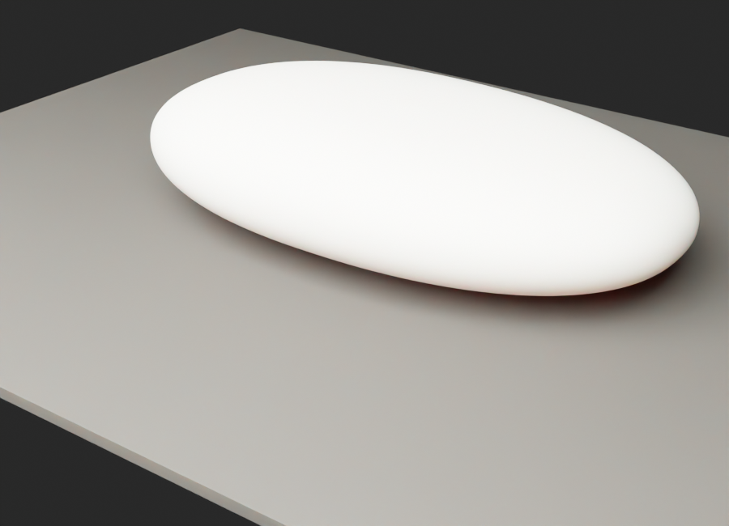
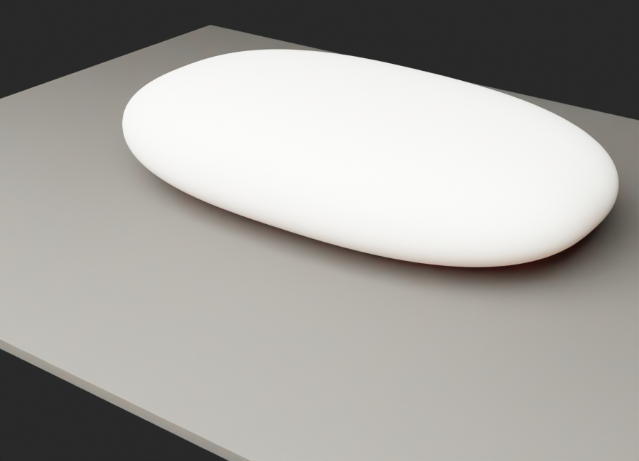
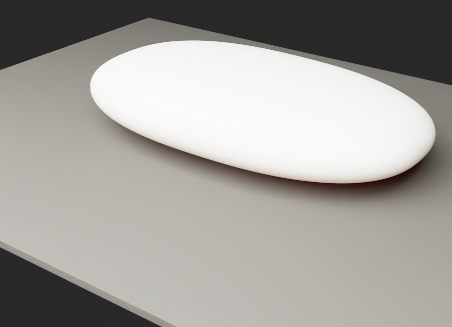
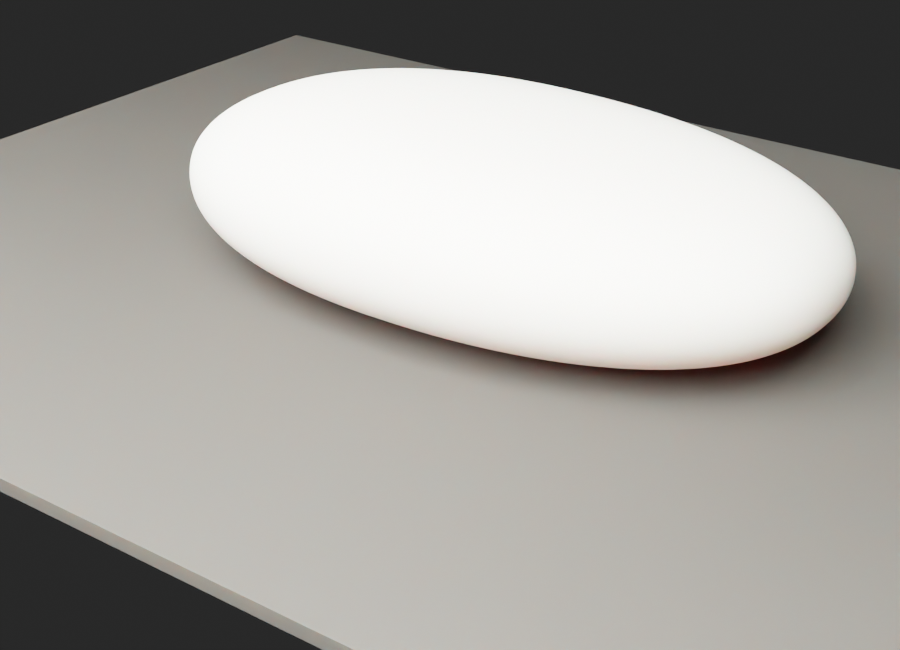
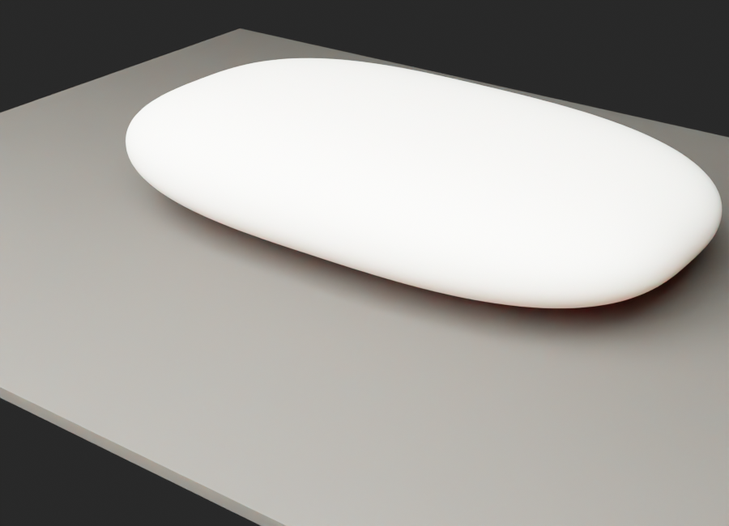
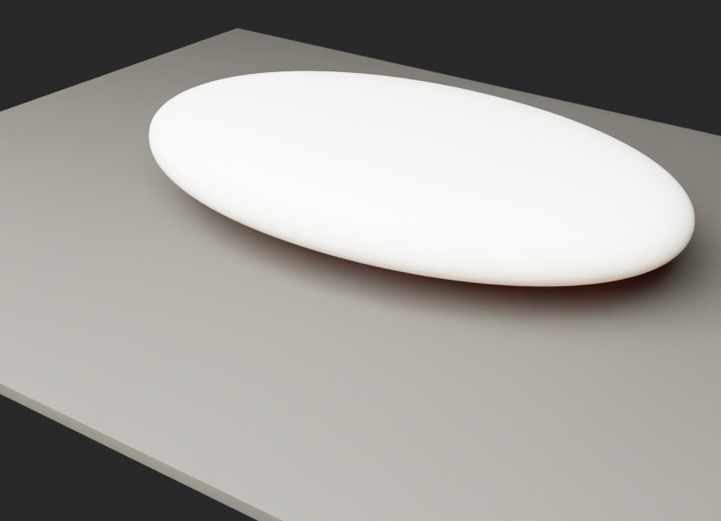
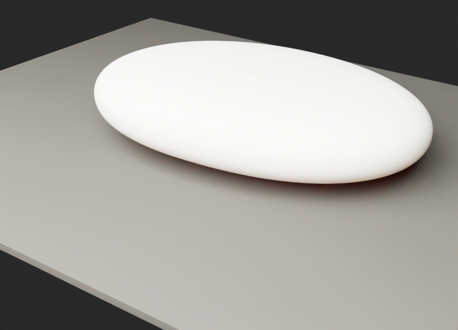
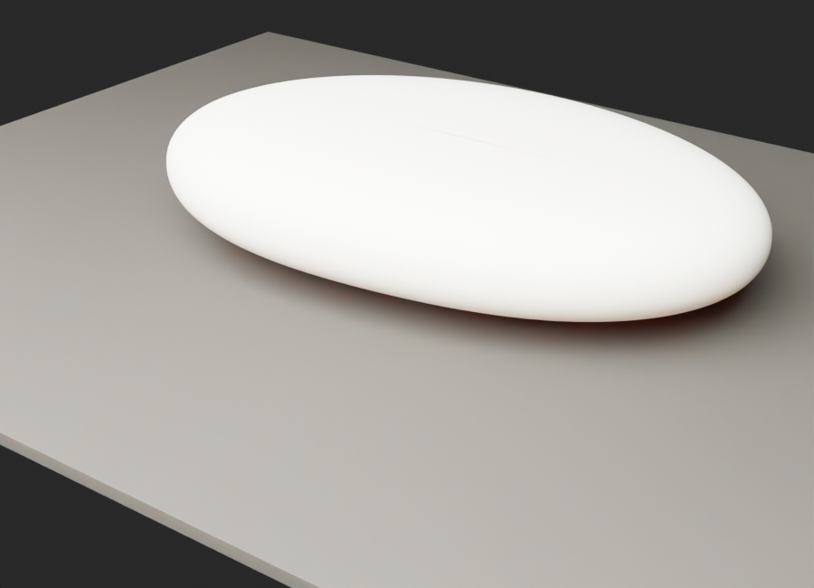
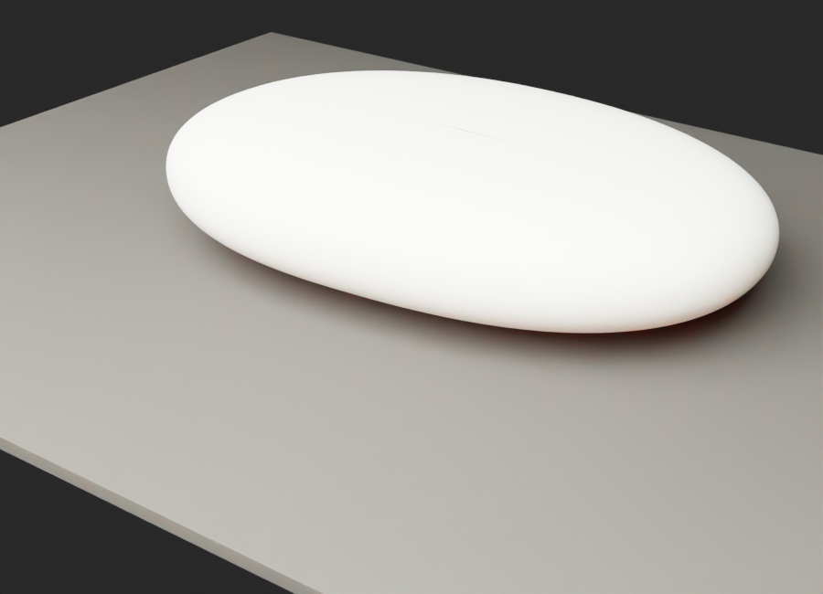

# Ezra Shape Iterations

Shape-only review. No mesh, no glow, no sensors, no material detailing.

| Variant | Render | Notes |
|---------|--------|-------|
| A - Reference Oval |  | Closest to the hand stone: simple oval, felt asymmetry, least gadget-like. |
| B - Golden Pebble |  | Current spec translated into a more natural pebble, still phone/pocket scaled. |
| C - Thinner Pocket |  | More pocketable and less object-heavy; may lose heirloom density. |
| D - Fuller Heirloom |  | Most stone-like mass and warmth; strongest hand presence. |
| E - Thumb Index |  | Same visual calm, stronger one-side flattening for pocket orientation. |
| F - Soft Capsule |  | More phone-compatible silhouette; safer for chargers but less natural. |
| G - Flat Hand Pebble |  | Closest to the grey reference: broad horizontal palm stone, low dome, soft lens edge. |
| H - Skipping Stone |  | Thinnest and calmest; very pocketable, but internal packaging becomes harder. |
| I - Weighted River Stone |  | Reference-like broad face with more belly for battery and hand warmth. |
| J - Skip Stone Spec |  | Direct translation of the new brief: 103 x 75 x 17.5 mm, broad and thin with lens taper. |
| K - Athletic Skip Stone |  | Faster leading end and stronger diagonal energy; more capable/tool-like. |
| L - Heavy Skip Stone |  | Keeps the skip-stone plan but restores internal volume for battery/speakers. |

Recommendation: choose silhouette first, then apply Corian/KRION material, luminous mesh, PPG island, charger packaging, and scene lighting to one selected direction.